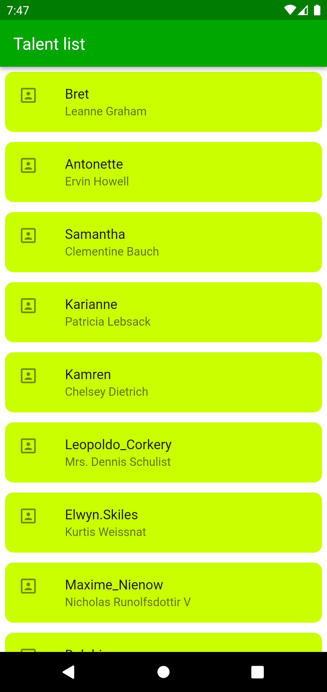
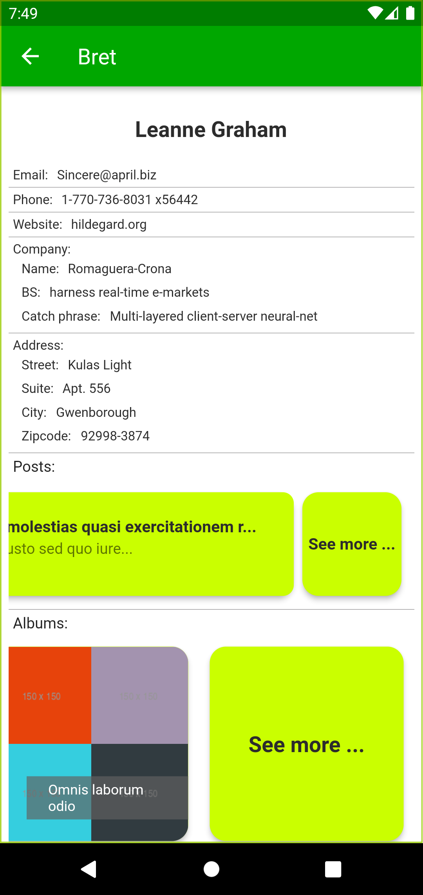
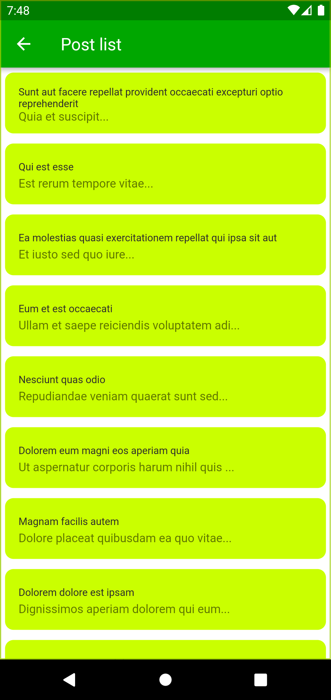
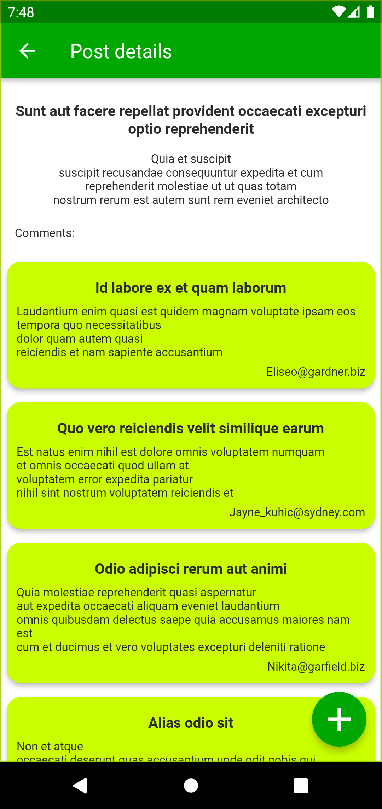
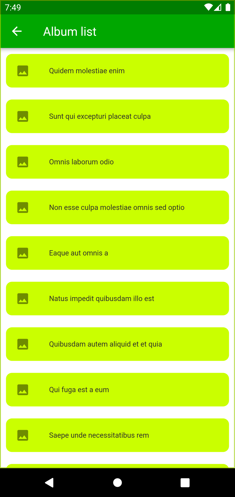
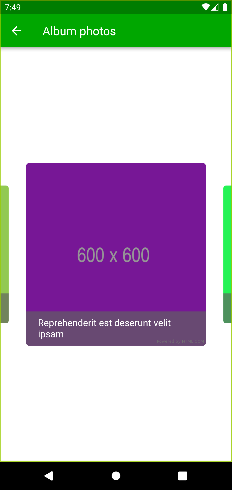

# Talent list

## Description
App for listing talents and their details.

## Tech stack
Dart/Flutter
BLOC

## Architecture
Feature driven directory structure 
BLOC for state management and business logic 
Custom Dart package talent_api and custom Dart package remote_talent_api  which implements talent_api are used for providing data 
Custom Dart package talent_repository wraps remote_talent_api 

## Other notes
Run the command below in talent_api package repository after adding new model with json annotations
`dart run build_runner build`

## Demos

  
  

  
  

  
  

